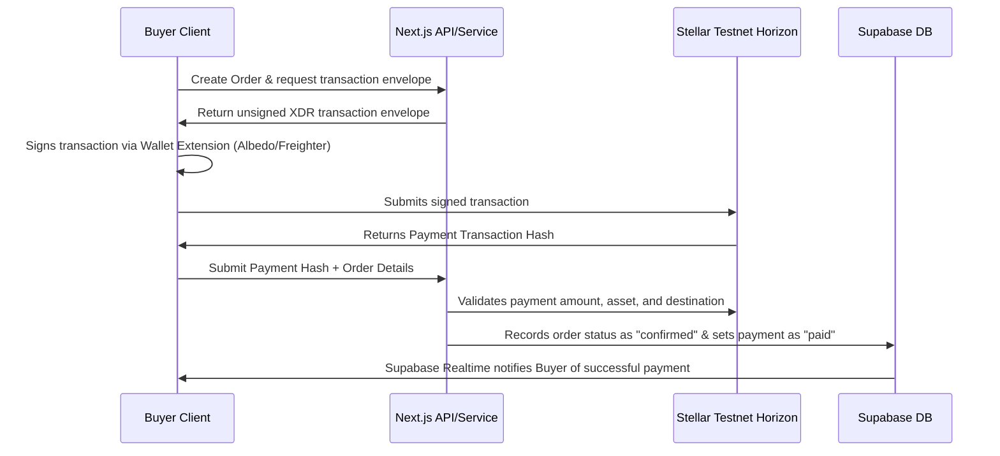

# AgroMarket 🌾

[](https://nextjs.org/)
[](https://www.typescriptlang.org/)
[](https://tailwindcss.com/)
[](https://supabase.com/)
[](https://stellar.org/)

AgroMarket is a production-grade, decentralized agricultural marketplace designed to connect local farmers (sellers) directly with wholesale and retail buyers. Built on Next.js 16 (App Router), Supabase SSR, and the Stellar Network, AgroMarket eliminates intermediaries, provides real-time transaction updates, and secures agricultural commerce with blockchain-based XLM payments.

---

## 📖 Table of Contents

- [Core Features](#-core-features)
- [Screenshots & UI Showcase](#-screenshots--ui-showcase)
- [Technology Stack](#-technology-stack)
- [Folder Structure](#-folder-structure)
- [Installation & Setup](#-installation--setup)
- [Supabase Configuration](#-supabase-configuration)
- [Stellar Testnet Integration](#-stellar-testnet-integration)
- [System Architecture](#-system-architecture)
- [Deployment Guide](#-deployment-guide)
- [Roadmap](#-roadmap)
- [Contributing](#-contributing)
- [License](#-license)

---

## ⚡ Core Features

### 👤 User Profiles & RBAC
- **Multi-Role Security:** Native support for `buyer`, `seller`, and `admin` roles.
- **Dynamic Route Guards:** Middleware-level path protection `/buyer/**`, `/seller/**`, and `/admin/**`.
- **KYC & Verification:** Seller approval workflow with admin moderation queues.

### 🚜 Product Management (CRUD)
- Farmers can upload produce listings with image hosting, location, quantity metrics, and batch units.
- Automatic inventory status tracking (In Stock / Out of Stock).

### 🛒 Checkout & Blockchain Payments
- **Stellar Network Integration:** Instant payment processing using Stellar XLM.
- **Transaction Logs:** Real-time transaction audits linked directly to Stellar Expert block explorer.
- **Escrow & Validation:** Automated order fulfillment matching buyer signatures with payment receipts.

### 💬 Communication & Real-time Feeds
- **Supabase Realtime:** Instant database trigger-based notifications for status changes (e.g. order dispatched, payment confirmed).
- **In-App & Email:** Custom toast feeds, badge counters, and pluggable transaction email adapters.

### 🌟 Reviews & Seller Reputation
- **Verified Purchase Enforcement:** Review access is limited to buyers who completed a successful order of the product.
- **Aggregated Statistics:** Dynamic Postgres views automatically recalculate ratings breakdown, five-star distribution, and response rates.

### 🔍 Advanced Discovery
- **Global Search:** Case-insensitive search across title, description, location, and seller name.
- **Telemetry-based Recommendations:** Curates carousels based on search logs, recently viewed items, and category history.

---

## 🖼️ Screenshots & UI Showcase

```
+-----------------------------------------------------------+
| AgroMarket Marketplace Header        [Bell (3)] [Profile]  |
+-----------------------------------------------------------+
|  [ Search cassava, maize... ] [Search]   [Filters V]       |
+-----------------------------------------------------------+
|                                                           |
|  Categories: [ Cassava ] [ Maize ] [ Yam ] [ Vegetables ] |
|                                                           |
|  Recommended For You:                                     |
|  +-------------------+  +-------------------+  +--------+ |
|  | Organic Cassava   |  | Sweet White Yam   |  | ...    | |
|  | ₦15,000 / Bag     |  | ₦8,000 / Bunch    |  |        | |
|  | [Add to Cart]     |  | [Add to Cart]     |  |        | |
|  +-------------------+  +-------------------+  +--------+ |
|                                                           |
+-----------------------------------------------------------+
```
*(Visual mocks can be added to the `/public/screenshots/` folder)*

---

## 🛠️ Technology Stack

- **Framework:** Next.js 16 (App Router, Server Actions, Dynamic Layouts)
- **Language:** TypeScript (Strict Mode)
- **Database:** Supabase (PostgreSQL, Row Level Security, Real-time Publications)
- **Styling:** Tailwind CSS + shadcn/ui components (based on `@base-ui` wrappers)
- **State & Caching:** TanStack React Query v5
- **Form Handling:** React Hook Form + Zod validation schemas
- **Payments:** Stellar SDK (Horizon Client, Keypairs, Testnet Horizon API)

---

## 📂 Folder Structure

```
src/
├── app/                  # Next.js pages, routing & layouts
│   ├── admin/            # Admin dashboard routes
│   ├── buyer/            # Buyer dashboard and purchase panels
│   ├── seller/           # Seller catalog & verification panels
│   ├── notifications/    # Notifications inbox, preferences, archives
│   ├── reviews/          # Ratings forms & reviews lists
│   └── marketplace/      # Public marketplace & product detail pages
├── components/           # Reusable generic UI components (button, dialog, input)
├── features/             # Feature-based modular architecture
│   ├── admin/            # Admin components, hooks, and management services
│   ├── auth/             # SessionProvider, signup/login forms, RBAC utils
│   ├── checkout/         # Shopping cart, checkout handlers, Stellar payment triggers
│   ├── notifications/    # Bells, badges, Realtime queries, email adapters
│   ├── reviews/          # Rating breakdown charts, stars, forms, seller responses
│   └── search/           # Search bars, sliders, recommendation lists, history logs
├── lib/                  # Configurations (Supabase client init, Tailwind classes)
└── proxy.ts              # Local dev proxies / next configuration utilities
```

---

## 🚀 Installation & Setup

### Prerequisites
- Node.js 20+
- npm or pnpm
- Supabase CLI (optional, or a Supabase cloud instance)
- A Stellar Testnet wallet keypair (details below)

### 1. Clone the repository
```bash
git clone https://github.com/yourusername/agromarket.git
cd agromarket
```

### 2. Install dependencies
```bash
npm install
```

### 3. Setup local environment variables
Create a `.env.local` file in the root directory:
```env
NEXT_PUBLIC_SUPABASE_URL=https://your-supabase-id.supabase.co
NEXT_PUBLIC_SUPABASE_ANON_KEY=eyJhbGciOiJIUzI1NiIsInR5cCI6IkpXVCJ9...
SUPABASE_SERVICE_ROLE_KEY=eyJhbGciOiJIUzI1NiIsInR5cCI6IkpXVCJ9...

NEXT_PUBLIC_STELLAR_NETWORK=TESTNET
NEXT_PUBLIC_STELLAR_HORIZON_URL=https://horizon-testnet.stellar.org
NEXT_PUBLIC_STELLAR_MERCHANT_ADDRESS=GA... # Merchant Stellar Account Address
STELLAR_MERCHANT_SECRET=SA... # Merchant Secret Key for processing refunds

EMAIL_PROVIDER=console # Choices: console | resend | sendgrid | postmark
```

---

## 💾 Supabase Configuration

AgroMarket relies on Postgres schemas, views, and RLS policies. Execute the migration scripts located in `/supabase/migrations/` sequentially inside the Supabase SQL editor:

1. `01_marketplace_schema.sql` — Profiles, product catalogues, and base RLS.
2. `02_seller_module.sql` — Seller profiles, verification parameters.
3. `03_buyer_module.sql` — Buyer registries.
4. `04_checkout_order_schema.sql` — Order items, checkout fields.
5. `05_stellar_payment_schema.sql` — Payment status & Stellar transaction hashes.
6. `06_order_management_schema.sql` — Tracking numbers & shipment status.
7. `07_profile_management_schema.sql` — Profile bio & personal details.
8. `08_admin_management_schema.sql` — Moderation cues, flagged products.
9. `09_notifications_schema.sql` — Notification categories, preferences, realtime publications.
10. `10_reviews_schema.sql` — Star distributions, ratings, reputation views.
11. `11_search_recommendations_schema.sql` — Recently viewed, search history telemetry.

*Ensure that Supabase Realtime is enabled for the `notifications` table by adding it to the publication list (handled automatically in Migration 9).*

---

## 🌌 Stellar Testnet Integration

Payments are settled directly on the Stellar blockchain testnet:
1. Create a Stellar account pair using the [Stellar Laboratory Keypair Generator](https://laboratory.stellar.org/#account-creator).
2. Fund your testnet accounts using **Friendbot** (adds free testnet XLM).
3. Set `NEXT_PUBLIC_STELLAR_MERCHANT_ADDRESS` to the public key of the merchant account.
4. Set `STELLAR_MERCHANT_SECRET` if automatic script transactions / testing is required.

---

## 🛠 Available Scripts

- `npm run dev` — Starts Next.js development server.
- `npm run build` — Compiles and builds the production bundle.
- `npm run start` — Runs the compiled Next.js production server.
- `npm run lint` — Runs ESLint checks.
- `npx tsc --noEmit` — Verifies TypeScript compilation and type-safety.

---

## 📐 System Architecture

### Blockchain Payment & Order Lifecycle


### Discovery Recommendations Engine
```
+---------------------------------------------------------------+
|                      Recommendation Engine                    |
+---------------------------------------------------------------+
              |                                 |
              v                                 v
   [ Telemetry Pipeline ]             [ Reputation Pipeline ]
   - Reads Search Logs                - Joins product_rating_summary
   - Checks recently_viewed           - Filters out flagged listings
   - Matches category history         - Computes highest avg ratings
              |                                 |
              +----------------+----------------+
                               |
                               v
               [ Output: discovery/page.tsx ]
```

---

## 🚀 Deployment Guide

### Vercel Deployment
1. Connect your GitHub repository to Vercel.
2. Configure the Environment Variables under Project Settings matching your `.env.local` configurations.
3. Vercel will automatically detect Next.js and build the production bundle.

### Supabase Deployment
1. Log into your Supabase Dashboard.
2. Link your local project directory to your remote database using Supabase CLI:
   ```bash
   supabase link --project-ref your-project-id
   ```
3. Push database configurations and migrations:
   ```bash
   supabase db push
   ```

---

## 📅 Roadmap

- [ ] Multi-asset payments (support USDC and other Stellar anchors).
- [ ] Integration with physical smart-lockers / logistics partners for automated delivery verification.
- [ ] Offline-first Progressive Web App (PWA) capabilities for farmers in remote regions.
- [ ] Advanced recommendation models using Vector databases.

---

## 🤝 Contributing

Contributions are welcome! Please follow these guidelines:
1. Fork the repository.
2. Create your feature branch (`git checkout -b feature/AmazingFeature`).
3. Commit your changes (`git commit -m 'feat: Add some AmazingFeature'`).
4. Push to the branch (`git push origin feature/AmazingFeature`).
5. Open a Pull Request.

---

## 📄 License

Distributed under the MIT License. See `LICENSE` for more information.

---

## 💖 Credits

Developed by the AgroMarket Open Source team. Special thanks to Stellar Development Foundation, Supabase developer community, and all local agricultural organizations providing design inputs.
